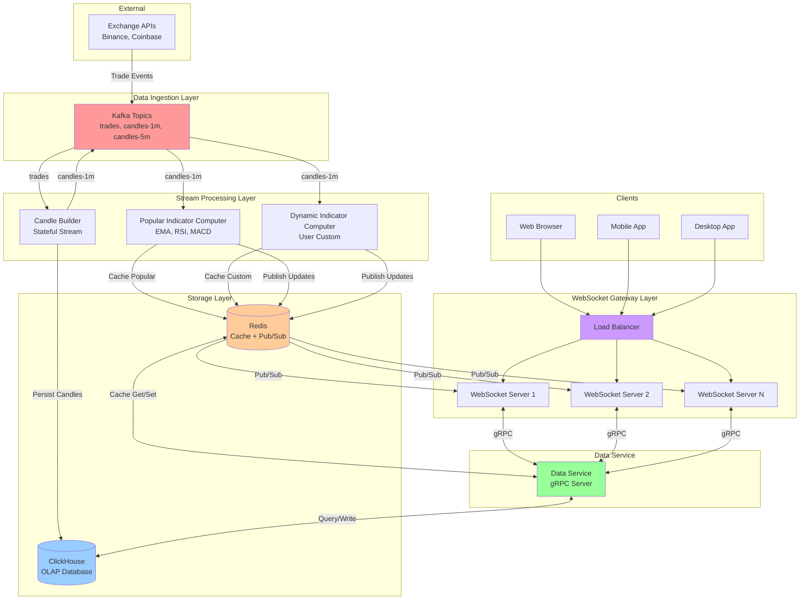
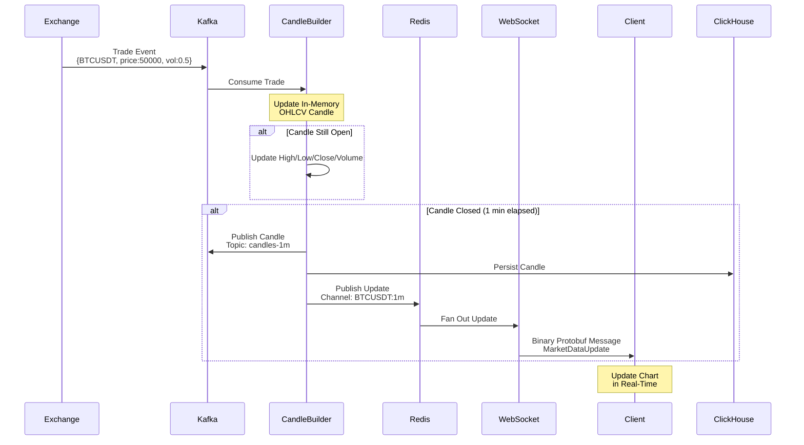
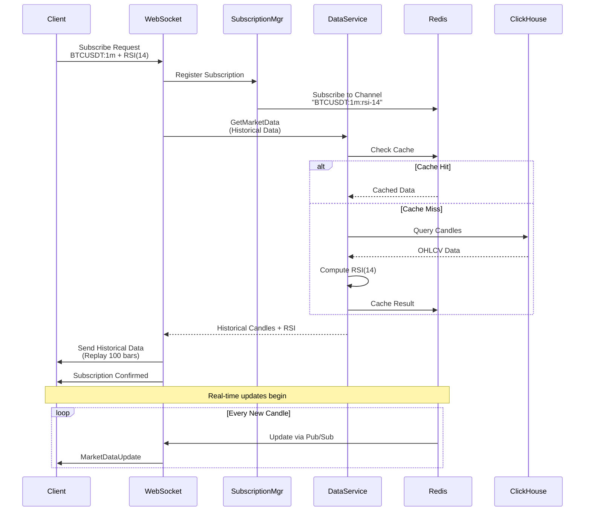
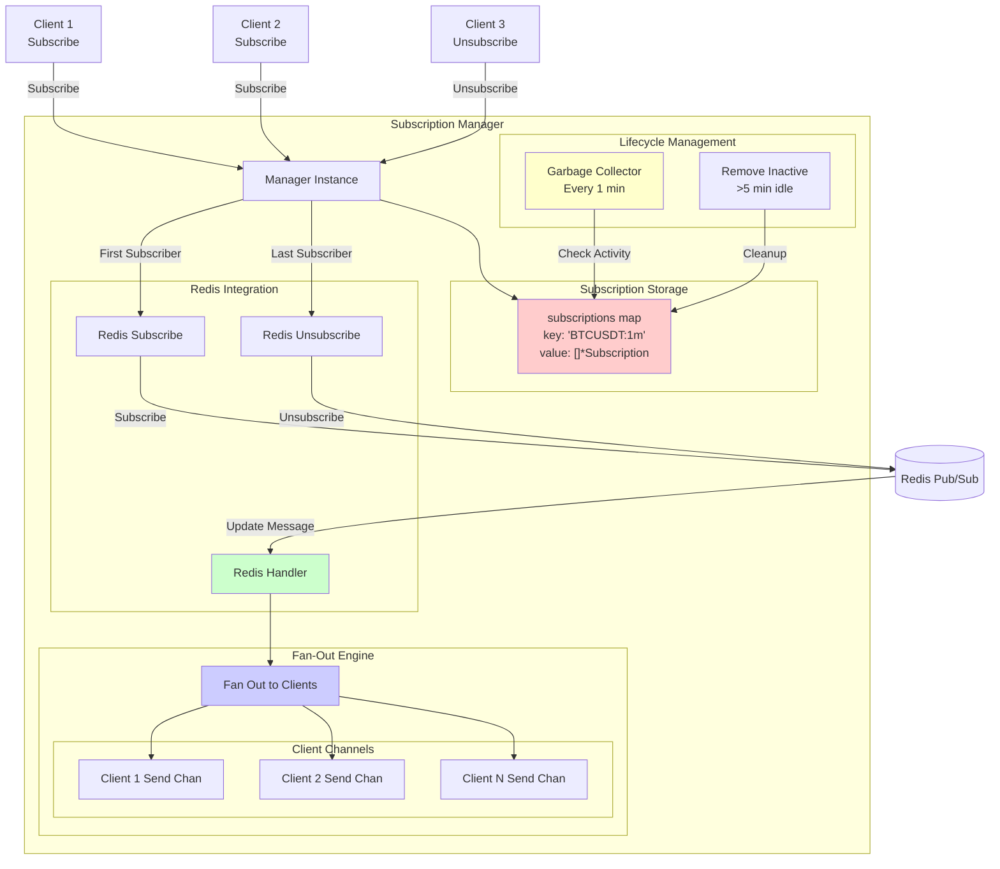
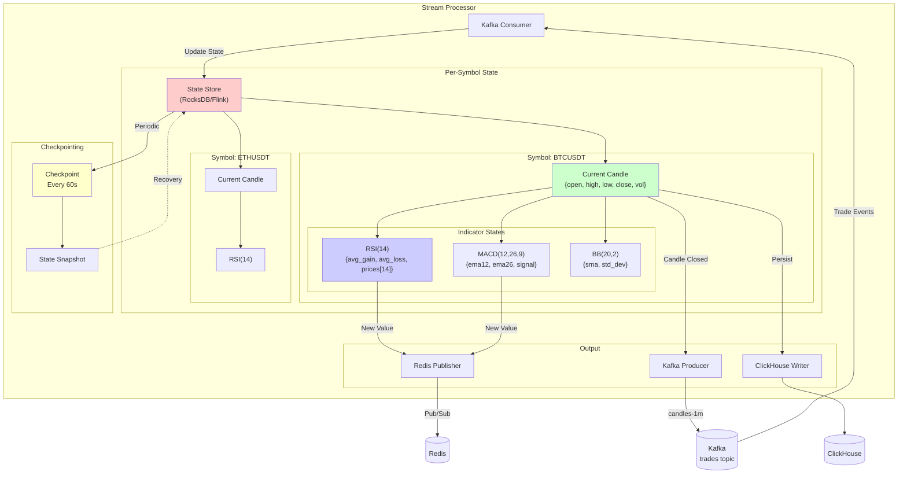
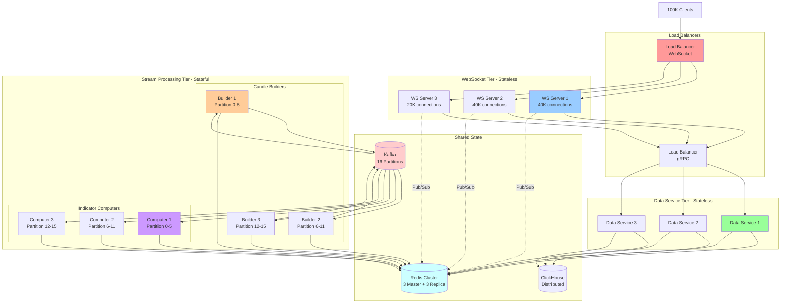

1. Complete System Overview



---

2. Real-Time Data Flow (Trade → Client)



---

3. Indicator Subscription Flow



---

4. WebSocket Server Internal Architecture

```mermaid
graph TB
    subgraph "WebSocket Server Process"
        HTTP[HTTP Handler<br/>:8080/v1/stream]

        subgraph "Connection Management"
            UP[Upgrader<br/>HTTP → WebSocket]
            CP[Client Pool<br/>sync.Map]
        end

        subgraph "Client Goroutines"
            direction LR
            C1[Client 1]
            C2[Client 2]
            CN[Client N]

            subgraph "Per Client"
                RP[Read Pump<br/>Goroutine]
                WP[Write Pump<br/>Goroutine]
                SC[Send Channel<br/>buffered 256]
            end
        end

        subgraph "Subscription Management"
            SM[Subscription Manager]
            SB[Subscriptions Map<br/>symbol:tf → []clients]
        end

        subgraph "External Communication"
            GRPC[gRPC Client<br/>→ Data Service]
            RPUB[Redis Pub/Sub<br/>Receiver]
        end

        HTTP --> UP
        UP --> CP
        CP --> C1
        CP --> C2
        CP --> CN

        C1 --> RP
        C1 --> WP
        RP --> SC
        SC --> WP

        RP -->|Subscribe Request| SM
        SM --> SB
        SM -->|Subscribe Channel| RPUB

        RP -->|Get Data Request| GRPC
        GRPC -->|Response| SC

        RPUB -->|Update| SM
        SM -->|Fan Out| SC
    end

    EXT_DS[Data Service<br/>gRPC Server]
    EXT_RD[Redis<br/>Pub/Sub]

    GRPC <-->|gRPC| EXT_DS
    RPUB <-->|Pub/Sub| EXT_RD

    style HTTP fill:#ffcccc
    style CP fill:#ccffcc
    style SM fill:#ccccff
    style GRPC fill:#ffffcc
    style RPUB fill:#ffccff
```

---

6. Data Service Request Flow

```mermaid
graph LR
    subgraph "WebSocket Server"
        WS[Client Connection]
    end

    subgraph "Data Service"
        GRPC[gRPC Handler]

        subgraph "Cache Layer"
            RC[Redis Cache]
            CHK{Cache Hit?}
        end

        subgraph "Computation Layer"
            IC[Indicator Computer]

            subgraph "Indicator Types"
                PRSI[RSI Calculator]
                PMACD[MACD Calculator]
                PBB[Bollinger Calculator]
                PCUST[Pine Script Engine]
            end
        end

        subgraph "Storage Layer"
            CH[(ClickHouse)]
        end
    end

    WS -->|GetMarketData<br/>BTCUSDT:1m<br/>RSI(14)| GRPC

    GRPC --> CHK

    CHK -->|Hit| RC
    RC -->|Cached Data| GRPC

    CHK -->|Miss| CH
    CH -->|OHLCV Candles| IC

    IC --> PRSI
    PRSI -->|RSI Values| IC

    IC -->|Cache Write| RC
    IC -->|Result| GRPC

    GRPC -->|Response| WS

    style CHK fill:#ffff99
    style RC fill:#99ff99
    style IC fill:#ff99ff
    style CH fill:#9999ff
```

---

7. Subscription Manager Architecture



---

8. Stream Processor State Management



9. Horizontal Scaling Architecture


